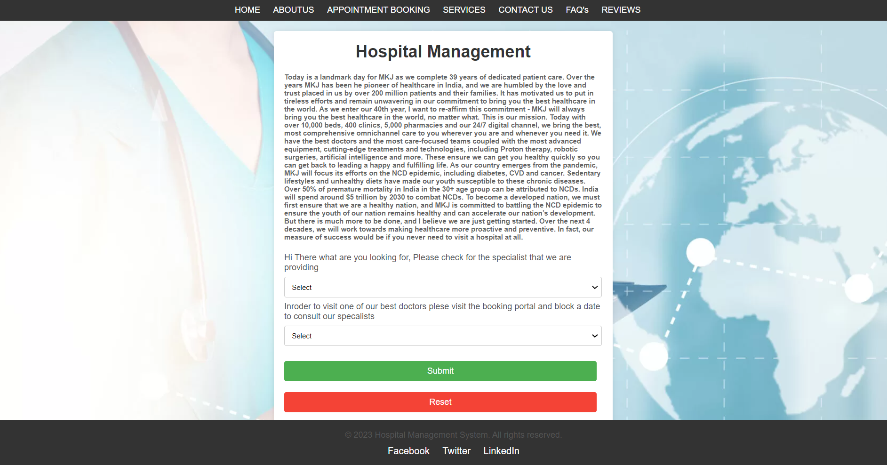
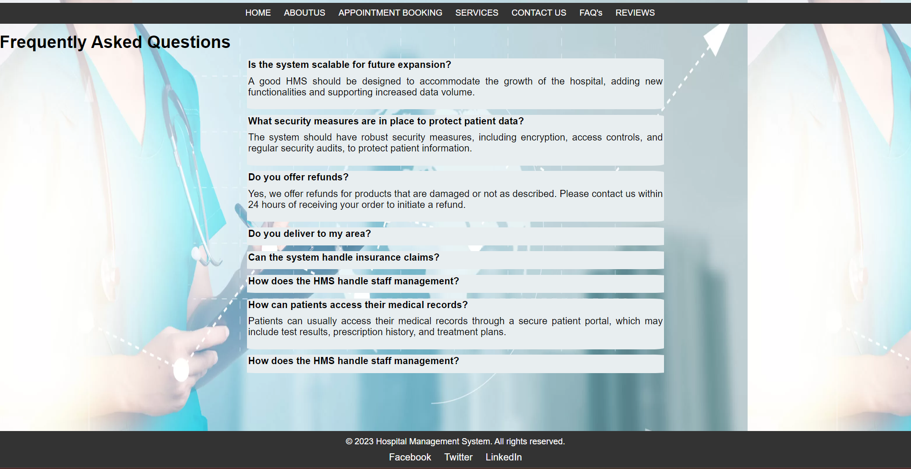
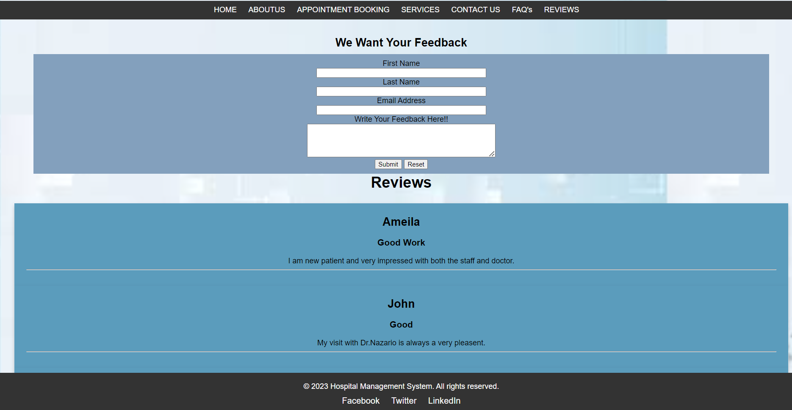
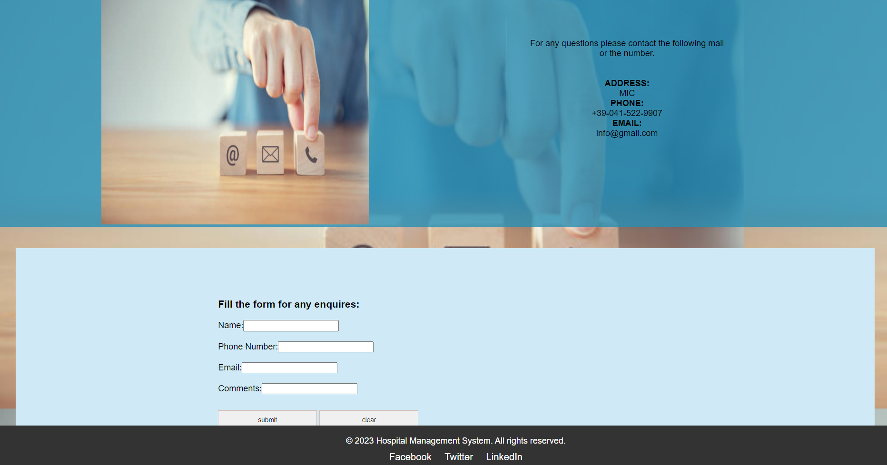

# Hospital Management System (HMS)

### Project Overview
The **Hospital Management System (HMS)** is a comprehensive web-based platform designed to enhance and streamline hospital operations. This system provides a user-friendly interface for managing appointments, providing hospital information, and allowing patients to interact with hospital services efficiently. HMS includes dynamic features like appointment booking, team introductions, reviews, an interactive FAQ, and a media gallery, built with modern web technologies.

### Features
- **Home Page:** Welcomes users and offers easy navigation to all other sections of the system.
- **About Us Page:** Displays detailed information about the hospital team and its doctors.
- **Booking System:** A smooth, step-by-step process to book appointments based on doctor specialization, with real-time confirmation through JavaScript.
- **Services Page:** Showcases the doctors’ specializations and services offered.
- **Contact Us Page:** Allows users to reach out with questions or comments through a contact form.
- **FAQ Section:** Provides answers to common questions with an interactive accordion using JavaScript.
- **Reviews Page:** Collects and displays feedback using AJAX requests to an XML file.

### Tech Stack Used
- **Frontend:** HTML5, CSS3, JavaScript, jQuery
- **Data Handling:** XML
- **Version Control:** Git, GitHub

### Screenshots
_**Home Page**_  
  

_**Booking Page**_ 
  

_**About Us Page**_
  

_**FAQ Section**_ 
  

  _**Reviews Page**_ 
  

_**ContactUs Page**_  
  

### How to Run
1. Clone the repository:
   ```bash
   git clone https://github.com/ramyashreeboga/Hospital_Management_System.git
